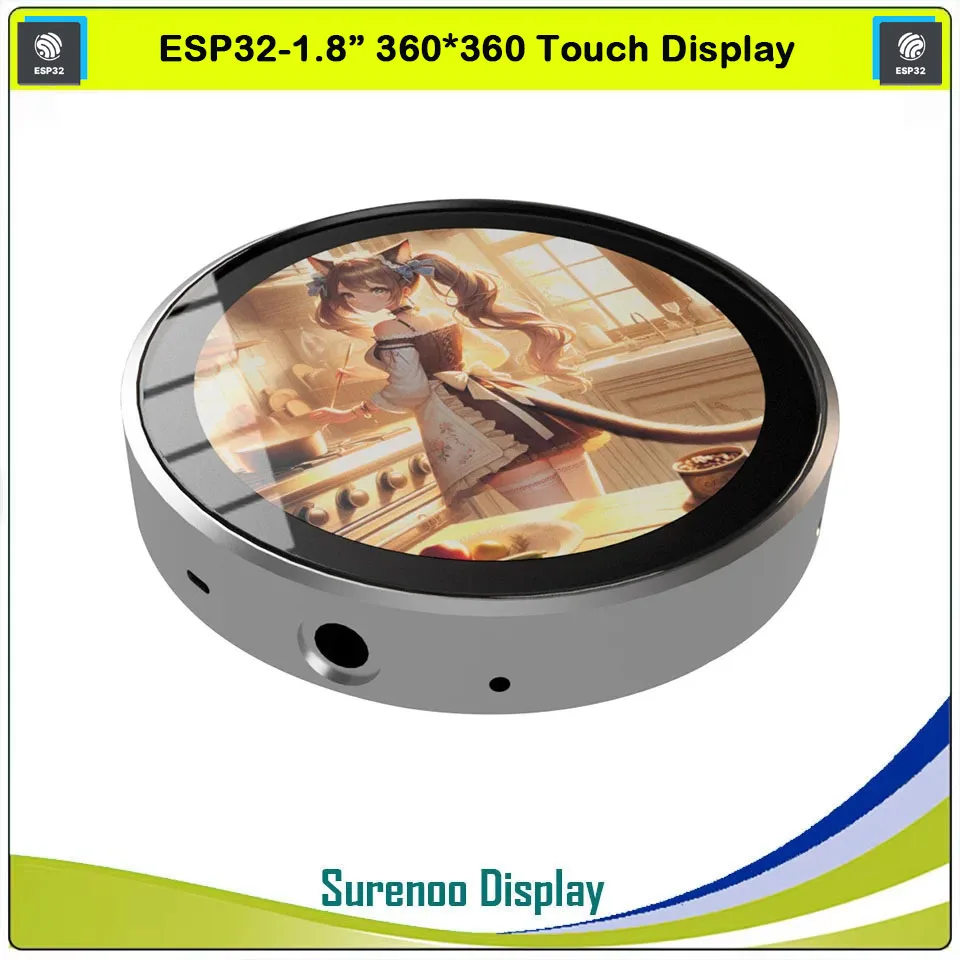

# Surenoo ESP32-S3 Guition-W5-Round Board

This project provides MicroPython configuration and support code for the Surenoo
Guition-W5-Round board. This doc only covers board-specific details. See the [Quick Reference](https://docs.micropython.org/en/latest/esp32/quickref.html) for generic ESP32
MicroPython information.



* ESP32-S3
* 16 MB flash
* 8 MB PSRAM
* 360x360 round 16-bit color display ST77916
* Touchscreen CST816
* I2S Stereo Headphone/Line-out DAC PCM5100
* I2S Microphone
* SD Card
* USB-C

You can request Surenoo's technical documentation and example code from
<info@surenoo.com>. Surenoo store [website](https://www.surenoo.com/collections/258656/products/23280116).

## Example

You can see how all the major peripherals (minus WiFi and Bluetooth) are used together
in the basic [example](examples/example.py). This code uses the various `make` utility
functions to initialize peripherals, and then looks for touches in two boxes displayed
on the screen. Touching the `Record` box invokes the `record` function to save
samples from the microphone to a file on the SD card. Similarly, the `Play` box
plays back the previously recorded file. The modules and classes used are
described briefly in the [Modules](#modules) section.

## Configuration

### Pins

Pin assignments are set in `pins.csv` and (mostly) follow the naming
in the schematic. You can access these via the `Pin.board` class,
e.g., `Pin.board.TP_SCL`.

The MicroPython configuration, `mpconfigboard.h` sets the default pins for I2C
and SPI. The IDF SDK configuration in `sdkconfig.board` specifies a 16MB flash
partition, enables the octal-mode 8MB PSRAM and sets the default CPU frequency
to 240MHz. Example output showing the results:

``` text
3.4.0; MicroPython v1.26.0-preview.257.gc16a4db151.dirty on 2025-06-24
Surenoo Guition W5 Round with ESP32S3
MicroPython-1.26.0-preview-xtensa-IDFv5.4-398-g473771bc14-with-newlib4.3.0
ID: fc:01:2c:d1:e3:c8
CPU frequency: 240000000
Memory: free 8318304, used 3232
SPI(id=1, baudrate=500000, polarity=0, phase=0, bits=8, firstbit=0, sck=12, mosi=11, miso=13)
I2C(0, scl=8, sda=7, freq=400000) ['0x15']
SPI(id=2, baudrate=500000, polarity=0, phase=0, bits=8, firstbit=0, sck=3, mosi=1, miso=2)
I2C(1, scl=9, sda=8, freq=400000) []
Pins: ['DAC_BCK', 'DAC_DIN', 'DAC_MCK', 'DAC_WS', 'DAC_XSMT', 'LCD_BLK', 'LCD_RST', 'MIC_SCK', 'MIC_SD', 'MIC_WS', 'QSPI_CS', 'QSPI_D0', 'QSPI_D1', 'QSPI_D2', 'QSPI_D3', 'QSPI_SCL', 'SDMMC_CMD', 'SDMMC_D0', 'SDMMC_D1', 'SDMMC_D2', 'SDMMC_D3', 'SDMMC_SCK', 'TP_INT', 'TP_RST', 'TP_SCL', 'TP_SDA']
MAC: 0xfc, 0x1, 0x2c, 0xd1, 0xe3, 0xc8
WLAN not connected
App: (0, 0, 65536, 2031616, 'factory', False)
Data: (1, 2, 36864, 24576, 'nvs', False)
Data: (1, 1, 61440, 4096, 'phy_init', False)
Data: (1, 129, 2097152, 14680064, 'vfs', False)
```

Of course, you can use different pins for the SPI and I2C instances
when creating them if these defaults do not match your hardware requirements.

## Modules

### guition_w5_round.py (board.py)

The `guition_w5_round.py` (aliased as board.py) module provides utility functions for
using the various board peripherals.

A convenience function, `make_display()`, constructs a`ST77916`display
driver object, from the `st77916.py` module and also enables the backlight
and disables the shutdown mode of the display.

Other functions:

* `backlight()`: set the display backlight, 0 - 100% using PWM
* `make_speaker()`: create an I2S instance for the speaker output
* `make_mic()`: create an I2S instance for the microphone input
* `make_touch()`: create a touchscreen controller

### st77916.py

This module implements a `framebuf.FrameBuffer` class, `ST77916`, for the
controller of the 360x360 16-bit (RGB565) color display. This boards uses a quad-SPI
interface between the ST77916 and the ESP32-S3.

In addition to the standard base
[`FrameBuffer`](https://docs.micropython.org/en/latest/library/framebuf.html)
methods, the `ST77916` provides the following properties (get/set):

* `rotation` - get/set the orientation (rotation) of the display
* `invert` - invert/un-invert the display
* `sleep` - sleep/awake the display - saves power while retaining the internal framebuffer memory

The overall brightness of the display can be changed using PWM on the
`Pin.board.LCD_BLK` pin. A utility function, `backlight()` is provided in the
`guition_w5_round.py` module. [Example](examples/display.py)

``` python
from time import sleep

from board import make_display, backlight


def main():
    display = make_display()
    display.fill(display.rgb(100, 0, 0))
    display.rect(0, 0, display.width, display.height, display.rgb(0, 128, 0))
    display.rect(display.width//2, display.height//2, 40, 40, 0xffff)
    display.text("Hello", display.width//2, display.height//2+50, display.rgb(0, 0, 200))

    display.show()

    for i in [0, 1, 2, 3]:
        backlight(25 + i * 25)
        display.rotation = i
        display.invert = i & 0x1
        display.show()
        sleep(2)

    backlight(0)
    display.deinit()


main()
```

The `make_display()` function:

``` python
from machine import Pin

from st77916 import ST77916
from qspi import QSPI


def make_display():
    backlight(75)
    qspi = QSPI(1, Pin(Pin.board.QSPI_SCL),
                [Pin.board.QSPI_D0, Pin.board.QSPI_D1, Pin.board.QSPI_D2, Pin.board.QSPI_D3],
                40_000_000)
    return ST77916(qspi, cs=Pin(Pin.board.QSPI_CS, Pin.OUT),
                   reset=Pin(Pin.board.LCD_RST, Pin.OUT, value=1))
```

Note that the `ST77916` class uses a quad-SPI driver, `QSPI`. This is implemented
via a user C module in [c_modules/qspi](c_modules/qspi) directory.

### cst8xx.py

This module provides the `CST8XX` class that supplies methods for detecting
and reporting touch coordinates on the display. [Example](examples/touch.py)

``` python
from time import sleep

from board import make_touch


def main():
    cst = make_touch()

    while True:
        if (p := cst.points) and p[2] == 0:
            print(p[0], p[1])

        sleep(0.01)


main()
```

The `make_touch()` function:

``` python
from machine import I2C, Pin

from cst8xx import CST8XX


def make_touch():
    return CST8XX(I2C(0), intr=Pin(Pin.board.TP_INT, Pin.IN))
```

### DAC/Headphones

The PCM5100 stereo I2S DAC only requires the built-in I2S class. There are
no programmable options other than the "soft mute" function controlled by
the `Pin.board.DAC_XSMT` pin. The `make_speaker()` function sets this pin to 1
(high) before creating the I2S instance:

``` python
from machine import Pin, I2S


def make_speaker(num_chan, bits, sample_rate):
    Pin(Pin.board.DAC_XSMT, Pin.OUT, value=1)
    return I2S(0, sck=Pin(Pin.board.DAC_BCK), ws=Pin(Pin.board.DAC_WS),
               sd=Pin(Pin.board.DAC_DIN), mode=I2S.TX, bits=bits,
               format=I2S.STEREO if num_chan == 2 else I2S.MONO,
               rate=sample_rate, ibuf=40000)
```

The simple [example](examples/speaker.py) below shows how to play a tone through the DAC.

``` python
from math import sin, tau
import array

from board import make_speaker

NUM_SAMPLES = 1000


def gen_tone(mul):
    freq = (tau / 40.0) * (1 + mul)
    return array.array("h", [int(8000.0 * sin(freq * i * chan))
                             for i in range(NUM_SAMPLES) for chan in (1, 2)])


def main():
    spkr = make_speaker(2, 16, 16_000)
    samples = gen_tone(1)
    while True:
        spkr.write(samples)


main()
```

### Microphone

The microphone is also connected via I2S and requires no other support.

``` python
from machine import Pin, I2S


def make_mic(sample_rate=16000):
    return I2S(1, sck=Pin(Pin.board.MIC_SCK), ws=Pin(Pin.board.MIC_WS), sd=Pin(Pin.board.MIC_SD),
               mode=I2S.RX, bits=16, format=I2S.MONO, rate=sample_rate, ibuf=40_000)
```

### SD Card

You can use the SD Card peripheral directly via the `SDCard` class. This
board uses the SDIO interface:

``` python
from machine import SDCard
from vfs import mount


def mount_sd(root="/sd"):
    sd = SDCard(slot=0, width=4, sck=Pin.board.SDMMC_SCK, cmd=Pin.board.SDMMC_CMD,
                data=(Pin.board.SDMMC_D0, Pin.board.SDMMC_D1, Pin.board.SDMMC_D2, Pin.board.SDMMC_D3),
                freq=80_000_000)
    mount(sd, root)
```

A simple [example](examples/sd.py):

``` python
from os import listdir

from board import mount_sd


def main():
    mount_sd()
    print(listdir("/sd"))


main()
```

## Build

You build the MicroPython firmware for this board using the `Makefile` and following
the [instructions](https://github.com/micropython/micropython/ports/esp32/README.md)
in the `ports/esp32` directory.

``` shell
bash$ activate ESP-IDF environment
bash$ make MICROPYTHON=/path/to/micropython/src deploy
```

Using the `deploy` target, you can build and flash in one step.

The build dependencies:

* MicroPython v1.26.0-preview c16a4db151
* ESP-IDF 5.4

## TODO

* Freeze `modules/` in `manifest.py`
